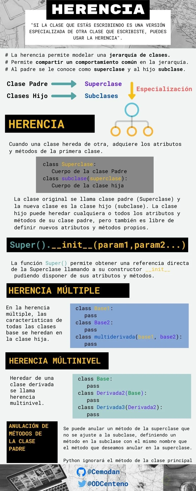

# Curso_de_POO_y_Algoritmos_con_Python

**Curso de Propgramación Orientada a Objetos y Algoritmos con Python** 

<h1 align="center">Hi 👋, I'm Mario Riascos</h1>
<h3 align="center">An electronic and telecomunications engineer of profession, i am apassionate for backend development from Colombia!</h3>

- 🌱 I’m currently learning **Frameworks, Djando, Flask, ApiRest, Odoo, Pythond development, backend, Html, CSS, git, mysql**

- 👨‍💻 All of my projects are available at [https://github.com/mfriascos?tab=repositories](https://github.com/mfriascos?tab=repositories)

- 📫 How to reach me **marioriascos1201@gmail.com**

- ⚡ Fun fact **I think i am funny**

<h3 align="left">Connect with me:</h3>
<p align="left">
<a href="https://twitter.com/@mariofeernando" target="blank"></a>
<a href="https://linkedin.com/in/mario-f-riascos1" target="blank"></a>
<a href="https://fb.com/mario.f.riascos" target="blank"></a>
</p>

<h3 align="left">Languages and Tools:</h3>
<p align="left"> <a href="https://www.arduino.cc/" target="_blank" rel="noreferrer">  </a> <a href="https://www.djangoproject.com/" target="_blank" rel="noreferrer">  </a> <a href="https://www.docker.com/" target="_blank" rel="noreferrer">  </a> <a href="https://flask.palletsprojects.com/" target="_blank" rel="noreferrer">  </a> <a href="https://git-scm.com/" target="_blank" rel="noreferrer">  </a> <a href="https://www.java.com" target="_blank" rel="noreferrer">  </a> <a href="https://developer.mozilla.org/en-US/docs/Web/JavaScript" target="_blank" rel="noreferrer">  </a> <a href="https://www.linux.org/" target="_blank" rel="noreferrer">  </a> <a href="https://www.mathworks.com/" target="_blank" rel="noreferrer">  </a> <a href="https://www.mysql.com/" target="_blank" rel="noreferrer">  </a> <a href="https://www.postgresql.org" target="_blank" rel="noreferrer">  </a> <a href="https://www.python.org" target="_blank" rel="noreferrer">  </a> </p>

**********************************************************************************************************************************************
<h2>CONTENT LIST</h2>

- [Programación Orientada a Objetos](#programación-orientada-a-objetos)
    - [Clases en Python](#clases-en-python)
    - [Instancias](#instancias)
    - [Atributos de la Instancia](#atributos-de-la-instancia)
    - [Métodos de Instancia](#métodos-de-instancia)
- [Tipos de Datos Abstractos y clases, Instancias](#tipos-de-datos-abstractos-y-clases-instancias)
    - [Instancias](#instancias)
    - [Decomposición](#decomposición)
    - [Abstracción](#abstracción)
- [Funciones: Base de los Decoradores](#funciones-base-de-los-decoradores)
- [Setters, Getters y Decorador Property](#setters-getters-y-decorador-property)
- [Herencia](#herencia)
- [Introducción a la Complejidad Algoritmica](#introducción-a-la-complejidad-algoritmica)
	- [Aproximaciones](#aproximaciones)
- [Algoritmos de Búsqueda y Ordenación](#algoritmos-de-búsqueda-y-ordenanción)
	- [Búsqueda Lineal](#búsqueda-lineal)
	- [Búsqueda Binaria](#búsqueda-binaria)
- [Ordenamiento de Burbuja](#ordenamiento-de-burbuja)
- [Ordenamiento por Inserción](#ordenamiento-por-inserción)
- [Ordenamiento por Mezcla](#ordenamiento-por-mezcla)
- [Ambientes Virtuales](#ambientes-virtuales)


# Programación Orientada a Objetos

Uno de los elementos más importantes de los lenguajes de programación es la utilización de clases para organizar programas en módulos y abstracciones de datos. 

Las clases se pueden utilizar de diversas maneras. Pero en este artículo hablaremos de cómo utilizarlas en el contexto de la programación orientada a objetos. La clave para entender la programación orientada a objetos es pensar en objetos como agrupaciones de datos y los métodos que operan en dichos datos. 

Por ejemplo, podemos representar a una persona con propiedades como nombre, edad, género, etc. y los comportamientos de dicha persona como caminar, cantar, comer, etc. De la misma manera podemos representar unos audifonos con propiedades como su marca, tamaño, color, etc. Y sus comportamientos como reproducir música, pausar y acanzar a la sihiente canción 

Puesto de otra manera, la programación orientada a objetos tienen más de 50 años y han sido ampliamente aceptadas y practicadas en los últimos treinta. A mediados de la decada de los setentase comenzaron a escribir artículos académicos explicando los beneficios de esta aproximación a la programación. También durante estos años se comenzaron a escribir los primeros lenguajes de programación que incorporaban estas ideas (como Smalltalk y CLU). Pero no fue hasta la llegada de java y C++ que la idea consiguió un número importante de seguidores. 

Hasta ahora, en el curso previo de esta serie hemos utilizado programación orientada a objetos de manera ímplicita. Cuando decimos "Los objetos son las principales cosas que un programa de python manipula. Cada objeto tiene un tipo que define qué cosas puede realizar un programa con dicho objeto", nos estamos refiriendo a las ideas principales de la programación orientada a objetos. Hemos utilizado los tipos lista y diccionario, entre muchos otros, así como los métodos asociados a dichos tipos. 

Así como los creadores de un lenguaje de programación sólo puede diseñar una fracción muuy pequeña de todas las funciones útiles (como abs, float, type, etc.), también pueden escribir una fracción muy pequeña de los tipos útiles (int, str, dict, list, etc.). Ya sabemos los mecanismos que nos permiten crear funciones, ahora veremos los mecanismos que nos permiten crear nuevos tipos (o clases). 

## Clases en Python 

Las estructuras primitivas con las que hemos trabajado hasta ahora nos permiten definir cosas sencillas, como el costo de algo, el nombre de un usuario, las veces que debe correr un bucle, etc. sin embargo, existen ocasiones cuando necesitamos definir estructuras más complejas, por ejemplo un hotel. Podríamos utilizar dos listas: una para definir los cuartos y una segunda para definir si el cuarto se encuentra ocupado o no. 

```python
cuartos_de_hotel = [101,102,103,201,202,203]
cuarto_ocupado = [True,False,False,True,True,False]
```
Sin embargo, este tipo de organización rápidamente se sale de control. ¿ Qué tal que quisiéramos añadir más propiedades, cómo si el cuarto ya fue aseado o no? ¿Si el cuarto tiene cama doble o sencilla? Esto nos lleva a una falta fuerte de organización y es justamente el punto que justifica la existencia de clases. 

Las clases nos permiten crear nuevos tipos que contienen información arbitraria sobre un objeto. En el caso del hotel podríamos crear dos clases Hotel() y Cuarto() que nos permitiera dar seguimiento a las propiedades como número de cuarto, ocupación, aseo, tipo de habitación, etc.

Es importante resaltar que las clases solo proveen estructura. son un molde con el cual podemos construir objetos específicos. La clases señala las propiedades que los hoteles que modelemos tendrán, pero no es ningún hotel específico. Para eso necesitamos las instancias. 

## Instancias

Mientras que las clases proveen la estructura, las instancias son los objetos reales que creamos en nuestro programa: un hotel llamado PlatziHotel o Hilton. Otra forma de pensarlo es que las clases son como un formulario y una que se llena cada copia del formulario tenemos las instancias que pertenecesn a dicha clase. Cada copia puede tener datos distintos, al igual que cada instancia es distinta de las demás (aunque todas pertenecen a una misma clase).

Para definir una clase, simplemente utilizamos el *keyword* **class**. Por ejemplo:

```python
class Hotel:
    pass
```
Una vez que tenemos una clase llamada **Hotel** podemos generar una instancia llamando al constructor de la clase. 

```python
hotel = Hotel()
```

## Atributos de la Instancia

Todas las clases crean objetos y todos los objetos tienen atributos. Utilizams el método especial _ _ init _ _ para definir el estado inicial de nuestra instancia. Recibe como primer parámetro obligatorio self( que es simplemente una referencia a la instancia).

```python
class Hotel: 

    def __init__(self, numero_maximo_de_huespedes, lugares_de_estacionamiento):
        self.numero_maximo_de_huespedes = numero_maximo_de_huespedes
        self.lugares_de_estacionamiento = lugares_de_estacionamiento
        self.huespedes = 0

hotel = Hotel(numero_maximo_de_huespedes=50, lugares_de_estacionamiento=20)
print(hotel.lugared_de_estacionamiento) #20
```

## Métodos de Instancia 

Mientras que los atributos de la instancia describen lo que representa el objeto, los métodos de instancia nos indican qué podemos hacer con las instancias de dicha clase y normalmente operan en los mencionados atributos. Los métodos son equivalentes a funciones dentro de la definición de la clase, pero todos reciben self como primer argumento. 

```Python
class Hotel:

    ...

    def anadir_huespedes(self, cantidad_de_huespedes):
        self.huespedes += cantidad_de_huespedes

    def checkout(self, cantidad_de_huespedes):
        self.huespedes -= cantidad_de_huespedes

    def ocupacion_total(self)
        return self.huespedes
    
hotel = Hotel(50,20)
hotel.anadir_huespedes(3)
hotel.checkout(1)
hotel.ocupacion_total() #2
```
# Tipos de Datos Abstractos y clases, Instancias

En Python todo es un objeto y tiene un tipo
* Representación de datos y formas de interactuar con ellos. 

formas de interactuar con un objeto
* Creación 
* Manipulación 
* Destrucción 

Ventajas: 
* Decomposición -> Es decir, estructurar objetos más pequeños
* Abstraccción  
* Encapsulación -> Esconder ciertos datos que no son importantes para ciertas personas 

```Python 
# Definición de clase 

class <nombre_de_la_clase>(<super_clase>):

    def __init__(self, <params>):           #Se definen los parametros de inicialización 
        <expresión>                         #Esta expresión puede ser vacía o se puede inicializar la clase 
    
    def <nombre_del_metodo>(self,<params>): #Define la funcionalidad de la clase 
        <expresión>
```
**Ejemplo**

```Python
# Definición 
class Persona:

    def __init__(self, nombre, edad):
        self.nombre = nombre
        self.edad = edad

    def saluda(self, otra_persona):
        return f"Hola {otra_persona.nombre}, me llamo {self.nombre}."

# Uso
>>> david = Persona('David',35)
>>> erika = Persona('Erika',32)

>>> david.saluda(erika)
"Hola Erika, me llamo David"
```

## Instancias

* Mientras que la clase es un molde, a los objetos creados se les conoce como instancias. 
* Cuando se crea una instancia , se ejecuta el método __ init __
* Todos los métodos de una clase reciben implícitamente como primer parámetro *self*
* Los atributos de clase nos permiten:
    * Representar datos 
    * Procedimientos para interactuar con los mismos(métodos)
    * Mecanismos para esconder la representación interna 
* Se accede a los atributos con la notación de punto. 
* Puede tener atributos privados. Por convención comienza con _

```Python
class Coordenada:

    def __init__(self, x, y):
        self.x = x
        self.y = y

    def distancia(self, otra_coordendada):
        x_diff = (self.x - otra_coordendada.x)**2
        y_diff = (self.y - otra_coordendada.y)**2

        return (x_diff + y_diff)**0.5


if __name__ == '__main__':
    coord_1 = Coordenada(3, 30)
    coord_2 = Coordenada(4, 8)

    #print(coord_1.distancia(coord_2))
    print(isinstance(coord_2,Coordenada))   # Nos permite determinar si alguna de estas coordenadas es instancia
                                            # de coordenada
```

## Decomposición 
* Partir un problema en problemas más pequeños. 
* Las clases permiten crear mayores abstracciones en forma de componentes. 
* Cada clase se encarga de una parte del problemas y el programa se vuelve más fácil de entender. 

## Abstracción 

* Enfocarnos en la información relevante 
* Separar la información central de los detalles secundarios 
* Podemos utilizar variables y métodos (privados o públicos)

# Funciones: Base de los Decoradores 

El concepto de decorador en Python es algo que podríamos ubicar en un nivel “intermedio” en el manejo del lenguaje, por lo que es buena idea que tengas una base sólida, sobre todo en cuanto a funciones al momento de profundizar e implementarlas.

Los decoradores son una forma sencilla de llamar **funciones de orden mayor**, es decir, funciones que toman otra función como parámetro y/o retornan otra función como resultado. De esta forma un decorador añade capacidades a una función sin modificarla.

Un ejemplo de esto son las llantas de un automóvil. Si les colocas cadenas para la nieve, el automóvil aún puede andar y además extiende su funcionalidad para conducirse en otros terrenos.

<h2>Recordando sobre funciones</h2>

Antes de abordar el tema de decoradores haremos un pequeño repaso por las funciones, las cuales retornan un valor ante la entrada de un argumento.

Analicemos este sencillo ejemplo donde una función que multiplica un número se eleva a la tercera potencia:
```python
def elevar_cubo(numero):
	return numero * numero * numero
```
Si damos como argumento el número 3, entonces tendremos como salida el número 27 al ejecutar la función:
```python
>>> elevar_cubo(3)
27
```

<h2>Funciones como objetos de primera-clase</h2>

Otro concepto importante a tener en cuenta es que en Python las funciones son objetos de primera-clase, es decir, que pueden ser pasados y utilizados como argumentos al igual que cualquier otro objeto (strings, enteros, flotantes, listas, etc.).

Veamos un ejemplo donde definimos 3 diferentes funciones que utilizaremos de manera conjunta:
```python
def presentarse(nombre):
	return f"Me llamo {nombre}"

def estudiemos_juntos(nombre):
	return f"¡Hey {nombre}, aprendamos Python!"

def consume_funciones(funcion_entrante):
	return funcion_entrante("David")
```

Las primeras dos funciones son obvias en su resultado, donde nos mostrarán un mensaje con el valor de la variable nombre. La tercera función puede ser más compleja de predecir, ya que toma otra función como entrada. Veamos que pasa cuando colocamos una función como atributo:
```python
>>> consume_funciones(presentarse)
'Me llamo David'

>>> consume_funciones(estudiemos_juntos)
'¡Hey David, aprendamos Python!'
```
Pongamos atención en cómo la función consume_funciones() se escribe con paréntesis para ser ejecutada, mientras que la función presentarse y estudiemos_juntos solo hace referencia a estas.

<h2>Funciones anidadas</h2>

Al igual que los condicionales y bucles también puedes colocar funciones dentro de otra función.

Tómate un minuto para analizar el siguiente código e inferir cuál será el resultado de salida:
```python
def funcion_mayor():
	print("Esta es una función mayor y su mensaje de salida.")

	def librerias():
		print("Algunas librerías de Python son: Scikit-learn, NumPy y TensorFlow.")

	def frameworks():
		print("Algunos frameworks de Python son: Django, Dash y Flask.")

	frameworks()
	librerias()
```

Si llamamos a la función funcion_mayor tendremos la siguiente salida:
```python
>>> funcion_mayor()
Esta es una función mayor y su mensaje de salida.
Algunos frameworks de Python son: Django, Dash y Flask.
Algunas librerías de Python son: Scikit-learn, NumPy y TensorFlow.
```

Debemos considerar que las funciones anidadas dentro de funcion_mayor no se ejecutan hasta que se llama a esta primera, siendo muestra del scope o alcance de las funciones. Si las llamamos obtendremos un error

En la siguiente lectura entraremos al concepto de decoradores, setters y getters, pues al entender mejor las funciones será más fácil asimilar su uso en la implementación del encapsulamiento.

# Setters, Getters y Decorador Property

En este punto estamos comenzando a utilizar conceptos en Python que comienzan a ser más avanzados, por lo que es normal que puedan parecerte complejos o difíciles de asimilar, así que te animo a que los repases un par de veces.

Puedes tener la tranquilidad de que si bien, al inicio, no los implementas en su totalidad, podrás seguir avanzando en el curso y poco a poco incorporarlos a tus proyectos donde lo más importante es que sepas que cuentas con estas herramientas.

<h2>Entendiendo el concepto de decorador</h2>

Antes de comenzar me gustaría que analices el siguiente código:

```python
def funcion_decoradora(funcion):
	def wrapper():
		print("Este es el último mensaje...")
		funcion()
		print("Este es el primer mensaje ;)")
	return wrapper

def zumbido():
	print("Buzzzzzz")

zumbido = funcion_decoradora(zumbido)
```

¿Qué pasará si llamamos a la función zumbido()? Si logras determinar el resultado de salida o entenderlo con detalle, entonces podemos seguir adelante.

Lo que sucede es lo siguiente:

```python
>>> zumbido()
Este es el último mensaje...
Buzzzzzz
Este es el primer mensaje ;)
```

Si no diste con el resultado no te preocupes, solo hay que analizarlo con detalle y el truco está en la línea zumbido = funcion_decoradora(zumbido). Sucede que la función wrapper() recibió la función zumbido() como parámetro y coloca su salida entre los otros dos prints.

Todo lo que sucede se conoce en programación como metaprogramación (metaprogramming), ya que una parte del programa trata de modificar a otra durante el tiempo de compilación. En tanto, un decorador básicamente toma una función, le añade alguna funcionalidad y la retorna.

<h2>Mejorando la sintaxis</h2>

Definitivamente, la forma en que decoramos la función es complejo, pero afortunadamente Python lo tiene en cuenta y podemos utilizar decoradores con el símbolo @. Volviendo al mismo ejemplo de funcion_decoradora(), podemos simplificarlo así:
```python
@funcion_decoradora
def zumbido():
	print("Buzzzzzz")
```
En solo tres líneas de código tenemos el mismo resultado que escribir zumbido = funcion_decoradora(zumbido).

<h2>¿Qué son getters y setters?</h2>

A diferencia de otros lenguajes de programación, en Python los getters y setters tienen el objetivo de asegurar el encapsulamiento de datos. Cómo habrás visto, si declaramos una variable privada en Python, colocamos un guion bajo al inicio de esta (_), y normalmente son utilizados para: añadir lógica de validación al momento de obtener y definir un valor y, para evitar el acceso directo al campo de una clase.

La realidad es que en Python no existen variables netamente privadas, pues aunque se declaren con un guion bajo, podemos seguir accediendo a estas. En Programación Orientada a Objetos esto es peligroso, pues podemos alterar el método de alguna clase y tener efectos colaterales que afecten la lógica de nuestra aplicación.

<h3>Clases sin getters y setters</h3>

Veamos un ejemplo con una clase que almacena un dato de distancia recorrida en millas (mi) y lo convierte a kilómetros (km):

```python
class Millas:
	def __init__(self, distancia = 0):
		self.distancia = distancia

	def convertir_a_kilometros(self):
		return (self.distancia * 1.609344)
```

Ahora creemos un objeto que haga referencia a un viaje:

```python
# Creamos un nuevo objeto
avion = Millas()

# Indicamos la distancia
avion.distancia = 200

# Obtenemos el atributo distancia
>>> print(avion.distancia)
200

# Obtenemos el método convertir_a_kilometros
>>> print(avion.convertir_a_kilometros())
321.8688
```

<h3>Utilizando getters y setters</h3>

Incluyamos un par de métodos para obtener la distancia y otro para que no acepte valores inferiores a cero, pues no tendría sentido que un vehículo recorra una distancia negativa. Estos son métodos getters y setters:

```python
class Millas:
	def __init__(self, distancia = 0):
		self.distancia = distancia

	def convertir_a_kilometros(self):
		return (self.distancia * 1.609344)

	# Método getter
	def obtener_distancia(self):
		return self._distancia

	# Método setter
	def definir_distancia(self, valor):
		if valor < 0:
			raise ValueError("No es posible convertir distancias menores a 0.")
		self._distancia = valor
```

El método getter obtendrá el valor de la distancia que y el método setter se encargará de añadir una restricción. También debemos notar cómo distancia fue reemplazado por _distancia, denotando que es una variable privada.

Si probamos nuestro código funcionará, la desventaja es que cualquier aplicación que hayamos creado con una base similar deberá ser actualizada. Esto no es nada escalable si tenemos cientos o miles de líneas de código.

<h2>Función property()</h2>

Esta función está incluida en Python, en particular crea y retorna la propiedad de un objeto. La propiedad de un objeto posee los métodos **getter(), setter() y del()**.

En tanto, la función tiene cuatro atributos: **property(fget, fset, fdel, fdoc)**:

* fget: trae el valor de un atributo.
* fset: define el valor de un atributo.
* fdel: elimina el valor de un atributo.
* fdoc: crea un docstring por atributo.

Veamos un ejemplo del mismo caso implementando la función property():

```python
class Millas:
	def __init__(self):
		self._distancia = 0

	# Función para obtener el valor de _distancia
	def obtener_distancia(self):
		print("Llamada al método getter")
		return self._distancia

	# Función para definir el valor de _distancia
	def definir_distancia(self, recorrido):
		print("Llamada al método setter")
		self._distancia = recorrido

	# Función para eliminar el atributo _distancia
	def eliminar_distancia(self):
		del self._distancia

	distancia = property(obtener_distancia, definir_distancia, eliminar_distancia)

# Creamos un nuevo objeto
avion = Millas()

# Indicamos la distancia
avion.distancia = 200

# Obtenemos su atributo distancia
>>> print(avion.distancia)
Llamada al método getter
Llamada al método setter
200
```

Aunque en este ejemplo hay una sola llamada a print, tenemos tres líneas como salida, pues esta llama a los primeros dos métodos. Por lo que la propiedad distancia es una propiedad de objeto que ayuda a mantener el acceso de forma privada.

<h2>Decorador @property</h2>

Este decorador es uno de varios con los que ya cuenta Python, el cual nos permite utilizar getters y setters para hacer más fácil la implementación de la programación orientada a objetos en Python cambiando los métodos o atributos de las clases de forma que no modifiquemos el código.

Pero mejor veamos un ejemplo en acción:

```python
class Millas:
	def __init__(self):
		self._distancia = 0

	# Función para obtener el valor de _distancia
	# Usando el decorador property
	@property
	def obtener_distancia(self):
		print("Llamada al método getter")
		return self._distancia

	# Función para definir el valor de _distancia
	@obtener_distancia.setter
	def definir_distancia(self, valor):
		if valor < 0:
			raise ValueError("No es posible convertir distancias menores a 0.")
		print("Llamada al método setter")
		self._distancia = valor

# Creamos un nuevo objeto
avion = Millas()

# Indicamos la distancia
avion.distancia = 200

# Obtenemos su atributo distancia
>>> print(avion.definir..distancia)
Llamada al método getter
Llamada al método setter
200
```

De esta manera usamos el decorador @property para utilizar getters y setters de una forma más prolija e incluimos una nueva funcionalidad a nuestro método definir_distancia(), al mismo tiempo protegemos el acceso a nuestras variables privadas y cumplimos con el principio de encapsulación.

# Encapsulación, Getters and Setters

* Encapsulación 
    * Permite agrupar datos y su comportamiento. 
    * Controla el acceso a dichos datos.
    * Previene modificaciones no autorizadas.

```python 
class CasillaDeVotacion():

    def __init__(self, identificador, pais):
        self.__identificador = identificador
        self.__pais = pais
        self.__region = None
    
    @property
    def region(self):
        return self.__region
    
    @region.setter
    def region(self,region):
        if region in self.__pais:
            self.__region = region
        else:
            raise ValueError(f'La region {region} no es válida en {self.__pais}')

>>> casilla = CasillaDeVotacion(123,['Ciudad de Mexico','Morelos])
>>> casilla.region
None
>>> casila.region = 'Ciudad de Mexico'
>>> casilla.region
'Ciudad de México
```

# Herencia 

* Permite modelar una jerarquía de clases 
* Permite compartir comportamiento común en la jerarquía 
* Al padre se le conoce como superclase y al hijo como subclase 

<p align="center"></p>

Un aspecto importantísimo de la Herencia es la posibilidad de reutilizar código. La reutilización es uno de los pilares de la POO, de manera que evitemos reinventar la rueda cada vez. Si tenemos un comportamiento que es común entre una serie de objetos de la misma categoría, este comportamiento debe enviarse a un clase superior que permita compartirlo con sus clases hijas. Esto facilita la mantenibilidad del código haciéndolo más estable.

# Polimorfismo 

* La habilidad de tomar varias formas 
* En python , nos permite cambiar el comportamiento de una superclase para  adaptarlo a la subclase 

# Introducción a la Complejidad Algoritmica 

* ¿Por qué comparamos la eficiencia de un algoritmo? 

* Complejidad temporal vs complejidad espacial 

* Podemos definirla como T(n)

## Aproximaciones 

* Cronometrar el tiempo en el que corre un algoritmo 
* Contar los pasos con una medida abstracta de operación 
* Contar los pasos conforme nos aproximamos al infinito 

# Clases de Complejidad Logaritmica 

* O(1) Constante  		# O -> Output
* O(n) Lineal
* O(log n) Logarítmica 
* O(nlog n) Log lineal 
* O(n**2) Polinomial
* O(2**n) Exponencial

# Algoritmos de Búsqueda y Ordenanción 

## Búsqueda Lineal 

* Busca en todos los elementos de manera secuencial 
* ¿Cuál es el peor caso? 

## Búsqueda Binaria 

* Divide y conquista 
* El problema se divide en 2 en cada iteración 
* ¿Cuál es el peor caso ? 

# Ordenamiento de Burbuja 

El ordenamiento de burbuja es un algoritmo que recorre rápidamente una lista que necesita ordenarse. Compara elementos adyacentes y los intercambia si están en el orden incorrecto. Este procedimiento se repite hasta que no se requieren más intercambios, lo que indica que la lista se encuentra ordenada. 

# Ordenamiento por Inserción 

El ordenamiento por inserción es uno de los algoritmos más comunes que estudian
los Científicos del Cómputo. Es intuitivo y fácil de implementar, pero es muy
ineficiente para listas de gran tamaño.

Una de las características del ordenamiento por inserción es que ordena en “su
lugar.” Es decir, no requiere memoria adicional para realizar el ordenamiento
ya que simplemente modifican los valores en memoria.

La definición es simple:

Una lista es dividida entre una sublista ordenada y otra sublista desordenada.
Al principio, la sublista ordenada contiene un solo elemento, por lo que por
definición se encuentra ordenada.

A continuación se evalua el primer elemento dentro la sublista desordenada para
que podamos insertarlo en el lugar correcto dentro de la lista ordenada.

La inserción se realiza al mover todos los elementos mayores al elemento que
se está evaluando un lugar a la derecha.

Continua el proceso hasta que la sublista desordenada quede vacia y, por lo
tanto, la lista se encontrará ordenada.

Veamos un ejemplo:

Imagina que tienes la siguiente lista de números:

7, 3, 2, 9, 8

Primero añadimos 7 a la sublista ordenada:

7, 3, 2, 9, 8

Ahora vemos el primer elemento de la sublista desordenada y lo guardamos en
una variable para mantener el valor. A esa variable la llamaremos valor_actual.
Verificamos que 3 es menor que 7, por lo que movemos 7 un lugar a la derecha.

7, 7, 2, 9, 8 (valor_actual=3)

3 es menor que 7, por lo que insertamos el valor en la primera posición.

3, 7, 2, 9, 8

Ahora vemos el número 2. 2 es menor que 7 por lo que lo movemos un espacio a la
derecha y hacemos lo mismo con 3.

3, 3, 7, 9, 8 (valor_actual=2)

Ahora insertamos 2 en la primera posición.

2, 3, 7, 9, 8

9 es más grande que el valor más grande de nuestra sublista ordenada por lo que
lo insertamos directamente en su posición.

2, 3, 7, 9, 8

El último valor es 8. 9 es más grande que 8 por lo que lo movemos a la derecha:

2, 3, 7, 9, 9 (valor_actual=8)

8 es más grande que 7, por lo que procedemos a insertar nuestro valor_actual.

2, 3, 7, 8, 9

Ahora la lista se encuentra ordenada y no quedan más elementos en la sublista
desordenada.

Antes de ver la implementación en Python, trata de implementarlo por ti mismo
y compártenos tu algoritmo en la sección de comentarios.

Esta es una forma de implementar el algoritmo anterior:

```Python
def ordenamiento_por_insercion(lista):

    for indice in range(1, len(lista)):
        valor_actual = lista[indice]
        posicion_actual = indice

        while posicion_actual > 0 and lista[posicion_actual - 1] > valor_actual:
            lista[posicion_actual] = lista[posicion_actual - 1]
            posicion_actual -= 1

        lista[posicion_actual] = valor_actual
```

# Ordenamiento por Mezcla

Es un algoritmo de divide y conquista. Primero divide una lista en partes iguales hasta que quedan sublistas de 1 o 0 elementos. Luego las recombina de forma ordenada. 

# Ambientes Virtuales 

* Permiten aislar el ambiente para poder instalar diversas versiones de paquetes 
* A partir de python3 se incluye en la librería estándar en el módulo venv
* Ningún ingeniero profesional de Python trabaja sin ellos 

# ¿ Por qué graficar?

* Reconocimiento de patrones 
* Predicción de una Serie 
* Simplifica la interpretación y las conclusiones acerca de los datos

